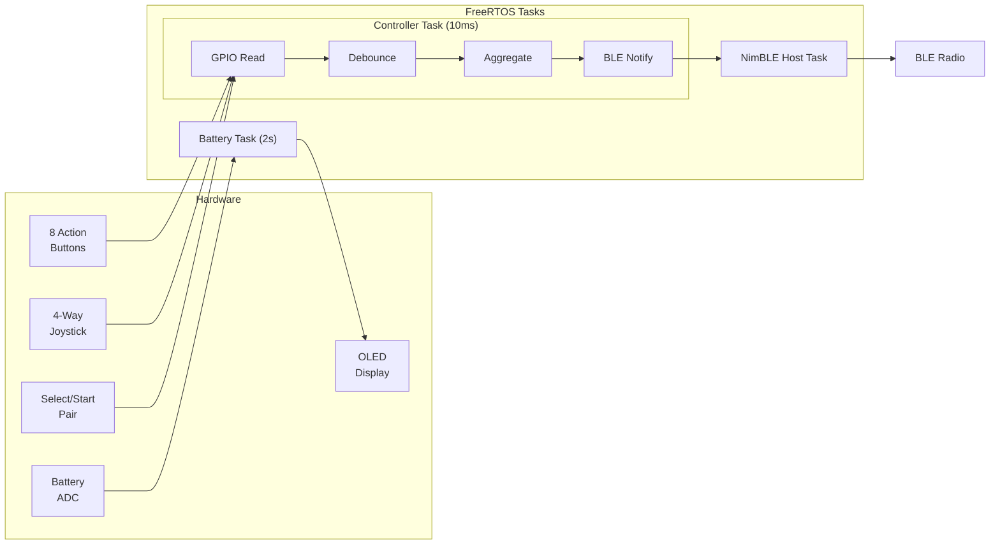
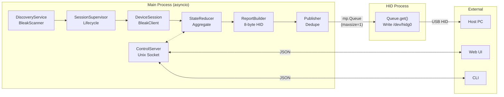

# OpenArcade System Architecture

## Full System Overview (Horizontal)

```
┌─────────────────────────────────────────────────────────────────────────────────────────────────────────────────────────────────────────────────────┐
│                                                              ESP32 CONTROLLER (Firmware)                                                             │
│                                                                                                                                                      │
│  ┌─────────────┐     ┌─────────────┐     ┌─────────────┐     ┌─────────────┐     ┌─────────────┐     ┌─────────────┐                                 │
│  │   Buttons   │     │  Debounce   │     │ Controller  │     │    GATT     │     │     GAP     │     │   Display   │                                 │
│  │   (GPIO)    │────►│   Module    │────►│   Input     │────►│   Service   │────►│  Advertise  │     │  (SSD1306)  │                                 │
│  │             │     │  (20-50ms)  │     │ (Aggregate) │     │  (Notify)   │     │  (Connect)  │     │             │                                 │
│  └─────────────┘     └─────────────┘     └─────────────┘     └─────────────┘     └──────┬──────┘     └─────────────┘                                 │
│        ▲                                        │                                       │                   ▲                                        │
│        │                                        │ 4-byte state                          │                   │                                        │
│  ┌─────┴─────┐                                  │ (32-bit bitmask)                      │             ┌─────┴─────┐                                  │
│  │  8 Action │                                  ▼                                       │             │  Battery  │                                  │
│  │  Buttons  │                         ┌───────────────┐                                │             │   (ADC)   │                                  │
│  │ + Joystick│                         │ BLE Notify    │◄───────────────────────────────┘             └───────────┘                                  │
│  │ + Sys Btns│                         │ (100Hz max)   │                                                                                             │
│  └───────────┘                         └───────┬───────┘                                                                                             │
│                                                │                                                                                                     │
└────────────────────────────────────────────────┼─────────────────────────────────────────────────────────────────────────────────────────────────────┘
                                                 │
                                                 │  BLE GATT Notifications (4 bytes @ up to 100Hz)
                                                 │
                                                 ▼
┌─────────────────────────────────────────────────────────────────────────────────────────────────────────────────────────────────────────────────────┐
│                                                         RASPBERRY PI (Server Runtime)                                                                │
│                                                                                                                                                      │
│  ┌─────────────────────────────────────────────────────────────────────────────────────────────────────────────────────────────────────────────────┐ │
│  │                                                        MAIN PROCESS (Async Runtime)                                                            │ │
│  │                                                                                                                                                 │ │
│  │  ┌───────────────┐    asyncio     ┌───────────────┐   spawns    ┌───────────────┐  callback   ┌───────────────┐           ┌───────────────┐    │ │
│  │  │   Discovery   │    Queue       │    Session    │ ──────────► │    Device     │ ──────────► │     State     │ ────────► │    Report     │    │ │
│  │  │   Service     │ ─────────────► │  Supervisor   │             │ Session (xN)  │             │    Reducer    │           │    Builder    │    │ │
│  │  │ (BLE Scanner) │                │  (Lifecycle)  │             │ (Per-device)  │             │  (Aggregate)  │           │  (8-byte HID) │    │ │
│  │  └───────────────┘                └───────────────┘             └───────────────┘             └───────────────┘           └───────┬───────┘    │ │
│  │                                                                                                       ▲                           │            │ │
│  │                                                                        state query                    │                           │            │ │
│  │                                          ┌───────────────┐◄───────────────────────────────────────────┘                           │            │ │
│  │                                          │ Control Server│                                                                        │            │ │
│  │                                          │ (Unix Socket) │                                                                        │            │ │
│  │                                          └───────┬───────┘                                                                        │            │ │
│  │                                                  │                                                                                │            │ │
│  └──────────────────────────────────────────────────┼────────────────────────────────────────────────────────────────────────────────┼────────────┘ │
│                                                     │                                                                                │              │
│                                                     │ JSON/IPC                                          multiprocessing.Queue        │              │
│                                                     ▼                                                         (maxsize=1)           │              │
│                                          ┌───────────────────┐                                                                       │              │
│                                          │  External Clients │                                                                       │              │
│                                          │   (Web UI / CLI)  │                                                                       │              │
│                                          └───────────────────┘                                                                       │              │
│                                                                                                                                      │              │
│  ┌─────────────────────────────────────────────────────────────────────────────────────────────────────────────────────────────────┐ │              │
│  │                                                      HID OUTPUT WORKER PROCESS                                                  │◄┘              │
│  │                                                                                                                                 │               │
│  │                                   Queue.get() ───────────────────────► Write to /dev/hidg0                                      │               │
│  │                                                                                                                                 │               │
│  └─────────────────────────────────────────────────────────────────────────────────────────────────────────────────────────────────┘               │
│                                                                                     │                                                              │
└─────────────────────────────────────────────────────────────────────────────────────┼──────────────────────────────────────────────────────────────┘
                                                                                      │
                                                                                      │ USB HID Protocol
                                                                                      ▼
                                                                            ┌───────────────────┐
                                                                            │     Host PC       │
                                                                            │   (USB Keyboard)  │
                                                                            └───────────────────┘
```

---

## ESP32 Firmware Layer

```
┌──────────────────────────────────────────────────────────────────────────────────────────────────────────────────────────────────────────┐
│                                                    ESP32 CONTROLLER FIRMWARE                                                              │
│                                                                                                                                          │
│   ┌───────────────────────────────────────────────────────────────────────────────────────────────────────────────────────────────────┐  │
│   │                                                    FreeRTOS Tasks                                                                 │  │
│   │                                                                                                                                   │  │
│   │   ┌─────────────────────────────────────────────────────────────────┐    ┌────────────────────┐    ┌────────────────────┐         │  │
│   │   │                    Controller Task (P5, 10ms loop)              │    │  NimBLE Host (P6)  │    │  Battery Task (P4) │         │  │
│   │   │                                                                 │    │                    │    │                    │         │  │
│   │   │  ┌──────────┐   ┌──────────┐   ┌──────────┐   ┌──────────────┐  │    │  ┌──────────────┐  │    │  ┌──────────────┐  │         │  │
│   │   │  │  GPIO    │──►│ Debounce │──►│ Aggregate│──►│ Send BLE     │  │    │  │ BLE Stack    │  │    │  │ ADC Read     │  │         │  │
│   │   │  │  Read    │   │ Filter   │   │ State    │   │ Notification │──┼────┼─►│ (NimBLE)     │  │    │  │ (2s interval)│  │         │  │
│   │   │  └──────────┘   └──────────┘   └──────────┘   └──────────────┘  │    │  └──────────────┘  │    │  └──────────────┘  │         │  │
│   │   │                                                                 │    │                    │    │                    │         │  │
│   │   └─────────────────────────────────────────────────────────────────┘    └────────────────────┘    └────────────────────┘         │  │
│   │                                                                                    │                          │                   │  │
│   └────────────────────────────────────────────────────────────────────────────────────┼──────────────────────────┼───────────────────┘  │
│                                                                                        │                          │                      │
│   ┌────────────────────────────────────────────────────────────────────────────────────┼──────────────────────────┼───────────────────┐  │
│   │                                                   Hardware Layer                   │                          │                   │  │
│   │                                                                                    ▼                          ▼                   │  │
│   │   ┌──────────────┐   ┌───────────────┐   ┌────────────┐   ┌─────────────────┐   ┌─────────────┐   ┌────────────────┐              │  │
│   │   │  8 Buttons   │   │  4-Way        │   │  Select    │   │  BLE Radio      │   │  Display    │   │  Battery       │              │  │
│   │   │  (Action)    │   │  Joystick     │   │  Start     │   │  (Advertise/    │   │  (SSD1306)  │   │  (ADC GPIO34)  │              │  │
│   │   │  GPIO 15,4,  │   │  GPIO 25,32,  │   │  Pair      │   │   Connect/      │   │  I2C 21,22  │   │                │              │  │
│   │   │  16,17,5,    │   │  33,26        │   │  GPIO 27,  │   │   Notify)       │   │             │   │                │              │  │
│   │   │  18,19,23    │   │               │   │  14,12     │   │                 │   │             │   │                │              │  │
│   │   └──────────────┘   └───────────────┘   └────────────┘   └─────────────────┘   └─────────────┘   └────────────────┘              │  │
│   │                                                                                                                                   │  │
│   └───────────────────────────────────────────────────────────────────────────────────────────────────────────────────────────────────┘  │
│                                                                                                                                          │
│   Button State Packet (4 bytes):  [ b1-b8 | joy_l,r,u,d | select,start,pair | reserved ]                                                │
│                                                                                                                                          │
└──────────────────────────────────────────────────────────────────────────────────────────────────────────────────────────────────────────┘
                                                                          │
                                                                          │ BLE GATT Notifications
                                                                          ▼
```

---

## Raspberry Pi Server Layer

```
┌──────────────────────────────────────────────────────────────────────────────────────────────────────────────────────────────────────────┐
│                                                     RASPBERRY PI SERVER                                                                   │
│                                                                                                                                          │
│   ┌───────────────────────────────────────────────────────────────────────────────────────────────────────────────────────────────────┐  │
│   │                                            MAIN PROCESS (asyncio event loop)                                                      │  │
│   │                                                                                                                                   │  │
│   │   ┌─────────────┐     ┌─────────────┐     ┌─────────────┐     ┌─────────────┐     ┌─────────────┐     ┌─────────────┐             │  │
│   │   │  Discovery  │     │   Session   │     │   Device    │     │    State    │     │   Report    │     │   Report    │             │  │
│   │   │   Service   │────►│ Supervisor  │────►│Session (xN) │────►│   Reducer   │────►│   Builder   │────►│  Publisher  │             │  │
│   │   │             │     │             │     │             │     │             │     │             │     │             │             │  │
│   │   │ BleakScanner│     │  Lifecycle  │     │ BleakClient │     │  Aggregate  │     │ 8-byte HID  │     │ Deduplicate │             │  │
│   │   │ "NimBLE_    │     │  Management │     │ GATT        │     │ All States  │     │ Keyboard    │     │ & Publish   │             │  │
│   │   │  GATT"      │     │  + Retry    │     │ Subscribe   │     │ to Keycodes │     │ Report      │     │             │             │  │
│   │   └─────────────┘     └─────────────┘     └─────────────┘     └─────────────┘     └─────────────┘     └──────┬──────┘             │  │
│   │                                                                      ▲                                       │                    │  │
│   │                                                                      │                                       │                    │  │
│   │   ┌─────────────────────────────────────────────────────────────────┐│                                       │                    │  │
│   │   │           RuntimeControlServer (Unix Socket IPC)                ││                                       │                    │  │
│   │   │                                                                 ││                                       │                    │  │
│   │   │  Commands: config_updated | get_connected_devices | get_states ─┘│                                       │                    │  │
│   │   └──────────────────────────────────┬──────────────────────────────┘                                        │                    │  │
│   │                                      │                                                                       │                    │  │
│   └──────────────────────────────────────┼───────────────────────────────────────────────────────────────────────┼────────────────────┘  │
│                                          │ JSON                                                                  │ multiprocessing      │
│                                          ▼                                                                       │ Queue                │
│   ┌──────────────────────────────────────────────────────────────────┐                                           │                      │
│   │                        External Clients                          │                                           │                      │
│   │                                                                  │                                           │                      │
│   │   ┌─────────────────┐              ┌─────────────────┐           │                                           │                      │
│   │   │     Web UI      │              │       CLI       │           │                                           │                      │
│   │   │  (Config/Debug) │              │   (Management)  │           │                                           │                      │
│   │   └─────────────────┘              └─────────────────┘           │                                           │                      │
│   │                                                                  │                                           │                      │
│   └──────────────────────────────────────────────────────────────────┘                                           │                      │
│                                                                                                                  │                      │
│   ┌──────────────────────────────────────────────────────────────────────────────────────────────────────────────┼───────────────────┐  │
│   │                                            HID OUTPUT WORKER PROCESS                                         │                   │  │
│   │                                                                                                              │                   │  │
│   │   ┌───────────────────┐         ┌────────────────────┐         ┌────────────────────┐                        │                   │  │
│   │   │   Queue.get()     │────────►│   Write Report     │────────►│   /dev/hidg0       │◄───────────────────────┘                   │  │
│   │   │   (blocking)      │         │   (8 bytes)        │         │   (USB Gadget)     │                                            │  │
│   │   └───────────────────┘         └────────────────────┘         └─────────┬──────────┘                                            │  │
│   │                                                                          │                                                       │  │
│   └──────────────────────────────────────────────────────────────────────────┼───────────────────────────────────────────────────────┘  │
│                                                                              │                                                          │
└──────────────────────────────────────────────────────────────────────────────┼──────────────────────────────────────────────────────────┘
                                                                               │ USB HID
                                                                               ▼
                                                                    ┌───────────────────┐
                                                                    │     Host PC       │
                                                                    └───────────────────┘
```

---

## Mermaid: Full System (Horizontal)

```mermaid
flowchart LR
    subgraph ESP32["ESP32 Controller"]
        direction LR
        GPIO["GPIO<br/>Buttons"] --> Debounce["Debounce<br/>Filter"]
        Debounce --> Aggregate["Aggregate<br/>State"]
        Aggregate --> GATT["GATT<br/>Service"]
        GATT --> BLE["BLE<br/>Radio"]
    end

    subgraph RPI["Raspberry Pi"]
        direction LR
        subgraph MainProc["Main Process (async)"]
            direction LR
            Disc["Discovery"] --> Sess["Session<br/>Supervisor"]
            Sess --> Dev["Device<br/>Session"]
            Dev --> Reduce["State<br/>Reducer"]
            Reduce --> Build["Report<br/>Builder"]
            Build --> Pub["Publisher"]
        end
        subgraph HIDProc["HID Process"]
            HID["Write<br/>/dev/hidg0"]
        end
        Pub --> HID
    end

    BLE -->|"BLE GATT<br/>4 bytes"| Disc
    HID -->|"USB HID"| PC["Host PC"]
```



---

## Mermaid: ESP32 Firmware (Horizontal)



---

## Mermaid: RPi Server (Horizontal)



---

## Component Reference

### ESP32 Firmware

| Component | File | Purpose |
|-----------|------|---------|
| **main** | `main/main.c` | Entry point, FreeRTOS task creation |
| **controller_input** | `main/src/controller_input.c` | GPIO config, state aggregation |
| **debounce** | `main/src/debounce.c` | Button debounce state machine |
| **gatt_svc** | `main/src/gatt_svc.c` | GATT service, BLE notifications |
| **gap** | `main/src/gap.c` | BLE advertising, connection mgmt |
| **display** | `main/src/display.c` | SSD1306 OLED driver |
| **battery** | `main/src/battery.c` | ADC battery monitoring |

### RPi Server

| Component | File | Purpose |
|-----------|------|---------|
| **DiscoveryService** | `runtime/discovery.py` | BLE scanning for `NimBLE_GATT` devices |
| **SessionSupervisor** | `runtime/sessions.py` | Device connection lifecycle |
| **DeviceSession** | `runtime/device_session.py` | Per-device BLE connection |
| **StateReducer** | `runtime/state_reducer.py` | Aggregate states to keycodes |
| **ReportBuilder** | `runtime/report_builder.py` | Build 8-byte HID report |
| **ReportPublisher** | `runtime/app.py` | Deduplicate and publish |
| **ControlServer** | `runtime/control_server.py` | Unix socket IPC |
| **HID Worker** | `hid_output_worker.py` | Write to `/dev/hidg0` |

---

## Data Flow Summary

| Stage | Component | Data | Format |
|-------|-----------|------|--------|
| 1 | ESP32 GPIO | Button states | Digital HIGH/LOW |
| 2 | Debounce | Filtered states | Boolean per button |
| 3 | Aggregate | Combined state | 32-bit bitmask (4 bytes) |
| 4 | BLE Notify | GATT notification | 4 bytes @ 100Hz max |
| 5 | RPi DeviceSession | Parsed state | Python dict |
| 6 | StateReducer | Aggregated (N devices) | Keycodes list |
| 7 | ReportBuilder | HID report | 8 bytes (modifier + 6 keys) |
| 8 | HID Worker | USB packet | Written to /dev/hidg0 |
| 9 | Host PC | Keyboard input | OS keyboard events |
