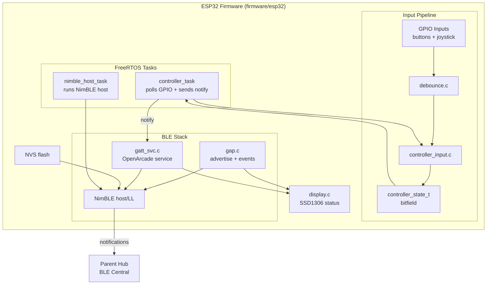
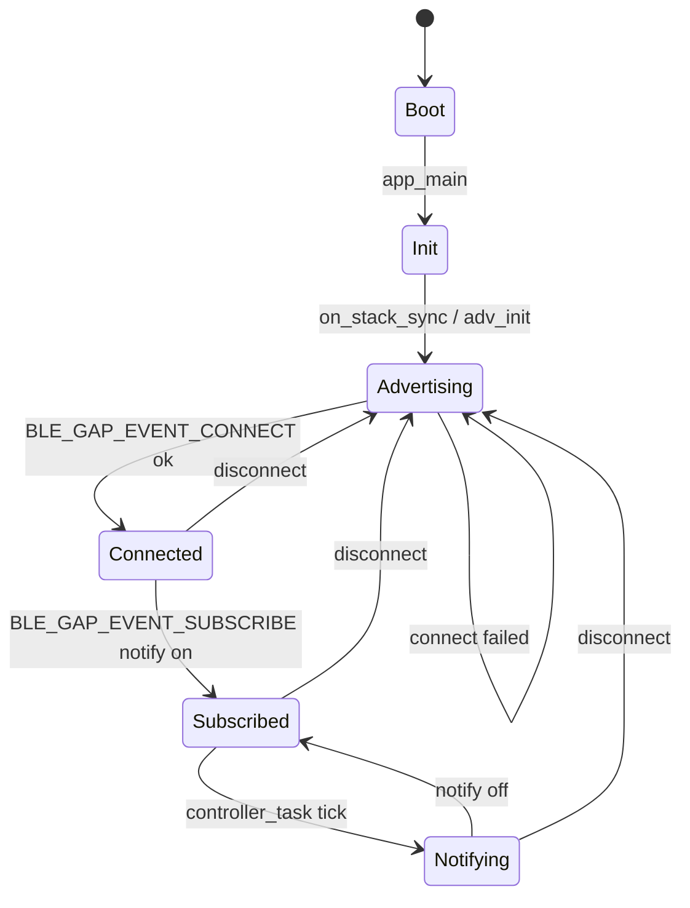
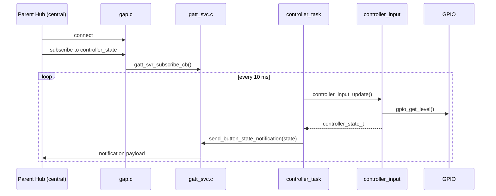
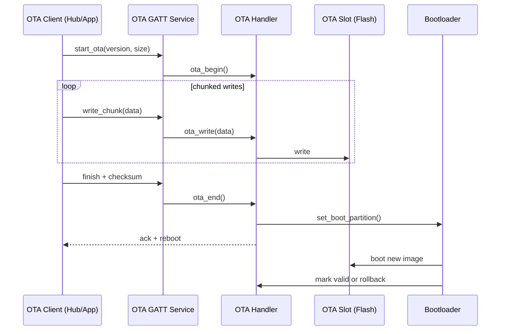
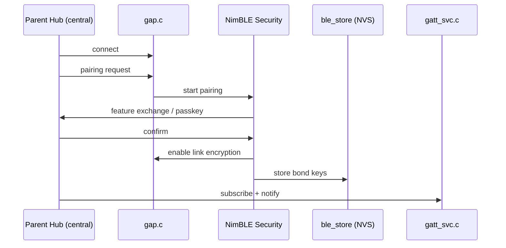
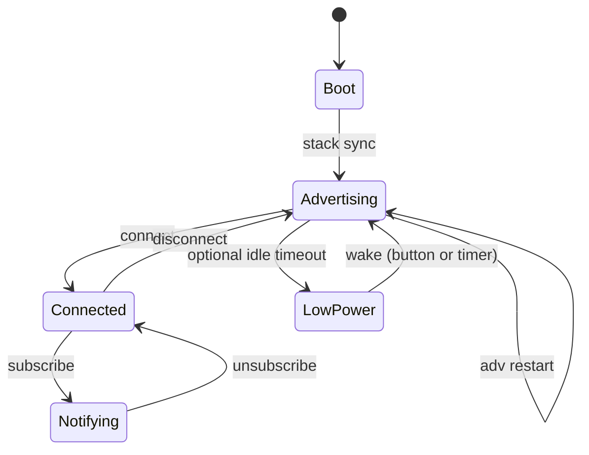

# BLE Firmware Diagrams

These diagrams describe the ESP32 BLE firmware in `firmware/esp32`.

## Architecture

## State Machine

## Data Flow (Controller State Notifications)

## OTA Update Flow (Conceptual)

## Security Pairing Flow (Conceptual)

## Power Management Flow (Conceptual)

## Notes

- OpenArcade BLE service is a 128-bit UUID with a notify-only controller state characteristic.
- `controller_task` polls inputs every 10 ms and sends notifications when subscribed.
- Display state updates occur on boot, subscribe, and disconnect events.
- OTA, security, and power diagrams are reference flows; firmware adds these when handlers and security configuration are implemented.
- Low-power mode is shown as optional and is not currently present in the firmware loop.
