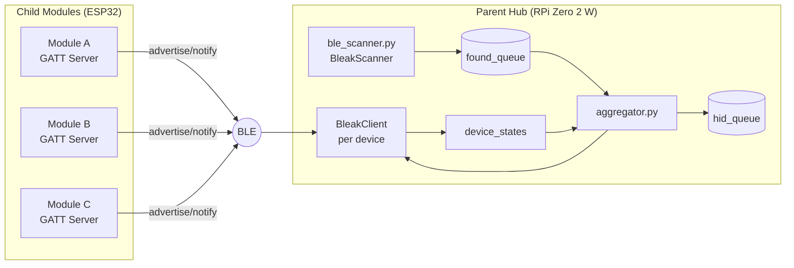

# Bluetooth + Multidevice Flow

```mermaid
flowchart LR
    subgraph Modules["Child Modules (ESP32)"]
        A[Module A\nGATT Server]
        B[Module B\nGATT Server]
        C[Module C\nGATT Server]
    end
    BLE((BLE))
    subgraph Pi["Parent Hub (RPi Zero 2 W)"]
        Scanner[ble_scanner.py\nBleakScanner]
        FoundQ[(found_queue)]
        Aggregator[aggregator.py]
        Clients[BleakClient\nper device]
        States[device_states]
        HidQ[(hid_queue)]
    end

    A -- advertise/notify --> BLE
    B -- advertise/notify --> BLE
    C -- advertise/notify --> BLE
    Scanner --> FoundQ --> Aggregator --> Clients
    BLE --> Clients --> States --> Aggregator --> HidQ
```
