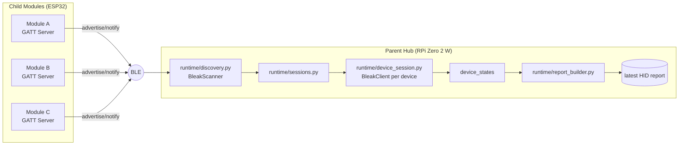

# Bluetooth + Multidevice Flow

```mermaid
flowchart LR
    subgraph Modules["Child Modules (ESP32)"]
        A[Module A\nGATT Server]
        B[Module B\nGATT Server]
        C[Module C\nGATT Server]
    end
    BLE((BLE))
    subgraph Pi["Parent Hub (RPi Zero 2 W)"]
        Discovery[runtime/discovery.py\nBleakScanner]
        Sessions[runtime/sessions.py]
        Clients[runtime/device_session.py\nBleakClient per device]
        States[device_states]
        Reports[runtime/report_builder.py]
        HidQ[(latest HID report)]
    end

    A -- advertise/notify --> BLE
    B -- advertise/notify --> BLE
    C -- advertise/notify --> BLE
    BLE --> Discovery --> Sessions --> Clients
    Clients --> States --> Reports --> HidQ
```
