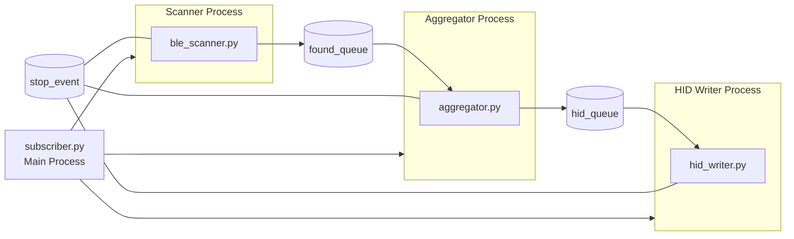

# Multicore Process Layout (Parent Hub)

```mermaid
flowchart LR
    Main[subscriber.py\nMain Process]
    subgraph ScannerProc["Scanner Process"]
        Scanner[ble_scanner.py]
    end
    subgraph AggregatorProc["Aggregator Process"]
        Aggregator[aggregator.py]
    end
    subgraph HidProc["HID Writer Process"]
        HID[hid_writer.py]
    end
    FoundQ[(found_queue)]
    HidQ[(hid_queue)]
    Stop[(stop_event)]

    Main --> ScannerProc
    Main --> AggregatorProc
    Main --> HidProc
    Scanner --> FoundQ --> Aggregator
    Aggregator --> HidQ --> HID
    Stop --- Scanner
    Stop --- Aggregator
    Stop --- HID
```
