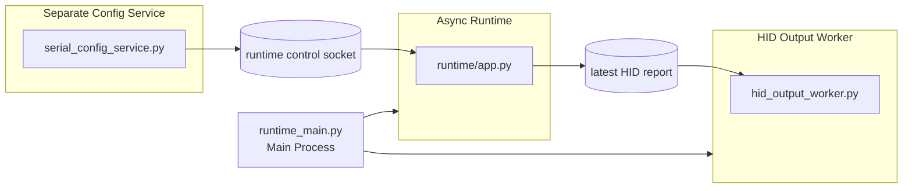

# Runtime Process Layout (Parent Hub)

```mermaid
flowchart LR
    Main[runtime_main.py\nMain Process]
    subgraph RuntimeProc["Async Runtime"]
        Runtime[runtime/app.py]
    end
    subgraph HidProc["HID Output Worker"]
        HID[hid_output_worker.py]
    end
    subgraph ConfigSvc["Separate Config Service"]
        Config[serial_config_service.py]
    end
    RuntimeSock[(runtime control socket)]
    HidQ[(latest HID report)]

    Main --> RuntimeProc
    Main --> HidProc
    Config --> RuntimeSock --> Runtime
    Runtime --> HidQ --> HID
```
