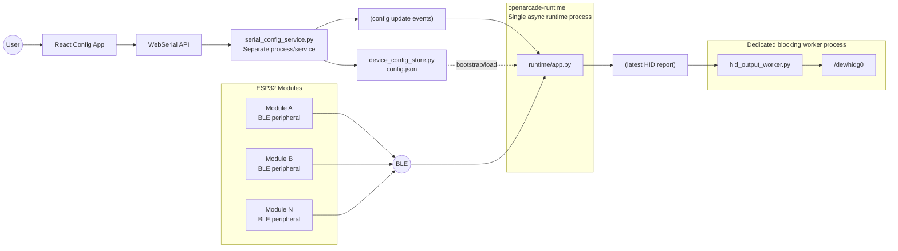
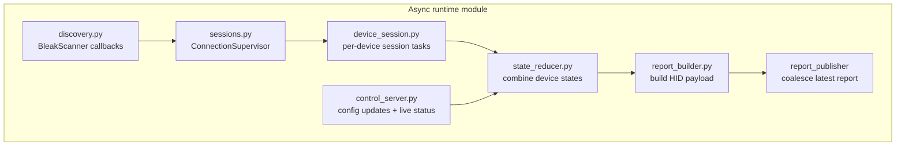
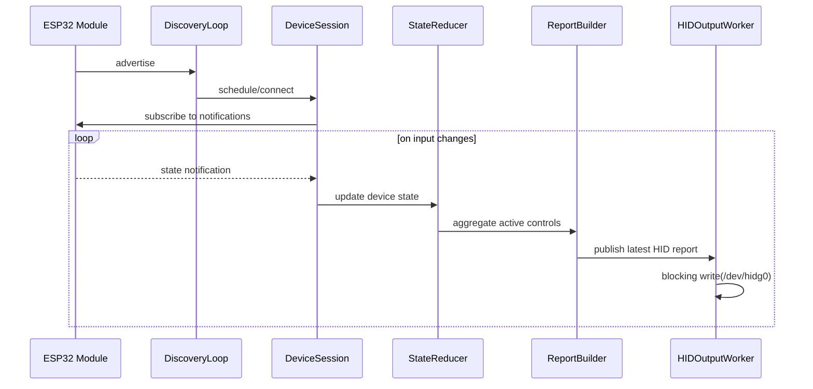
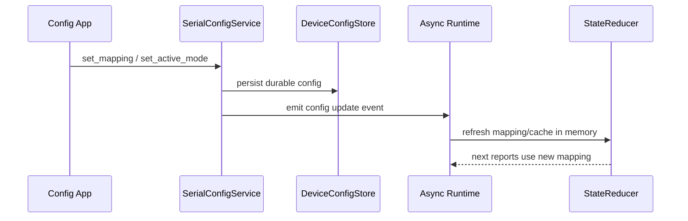

# Cooperative Runtime Architecture

This diagram set describes the proposed server-side architecture after consolidating BLE work into a single async runtime module while keeping configuration and HID output isolated behind clear boundaries.

Proposed naming:

- Async runtime module: `runtime`
- Blocking HID process: `hid_output_worker`
- Separate config service: `serial_config_service`
- Config persistence: `device_config_store`
- Runtime IPC boundary: `runtime/control_server.py`

## System Overview

## Async Runtime Internals

## Runtime Data Flow

## Config Update Path

## Design Notes

- BLE discovery, connection management, notifications, and aggregation stay in one cooperative event loop.
- The HID writer remains its own process because `/dev/hidg0` writes are blocking and form a natural isolation boundary.
- Config stays separate for now, but moves from file polling toward explicit update events.
- The runtime should publish the latest HID state, not an unbounded backlog of stale reports.
- `connected` state is best treated as runtime state; durable configuration should stay in `device_config_store`.
